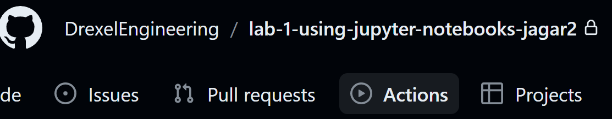
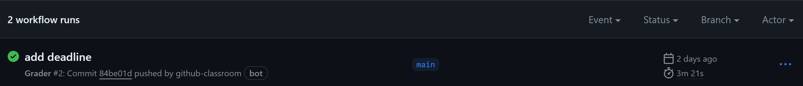
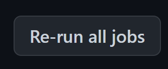

# Guide to Re-running an Action in GitHub

## Overview

In this class we use an automated grading system to grade your assignments. This system is built on top of GitHub Actions. GitHub Actions are a way to automate tasks in GitHub. In this class we use GitHub Actions to grade your assignments. If we encounter an error that influences the execution of the grading system we can push an update to the grading system, and will ask you to re-run the grading system. This guide will walk you through the steps to re-run the grading system.

## Option 1

### Step 1

Go to your github classroom repository and click on the "Actions" tab.

### Step 2

Click on the most recent action, in this figure (add deadline). You will only have one action in your repository -- unless you built your own -- which if you did, you probably don't need this guide. 

### Step 3

Click on the button re-run all jobs.

### Step 4

Wait for the action to complete. You will see in your repository a new Grade_Report.md file. Check the file to see your grade an make sure your information was recorded correctly. It should look something like this:

# Score for Lab_1

## Student Information
- **First Name:** jay
- **Last Name:** doe
- **Student ID:** jd123
- **Email:** jd123@drexel.edu

### Scores

| Total Score | Maximum Score | Percentage |
|-------------|---------------|------------|
| 15.0 | 15.0 | 100.0% |

### Detailed Scores

| Question ID | Score | Max Score | Visibility |
|-------------|-------|-----------|------------|
| 1 | 0 | 0 | Visible |
| 2 | 10 | 10 | Hidden |
| 3 | 5 | 5 | Hidden |